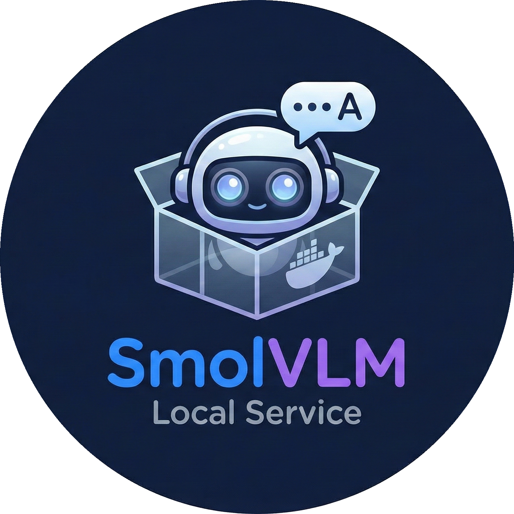

<!-- Improved compatibility of back to top link: See: https://github.com/othneildrew/Best-README-Template/pull/73 -->
<a id="readme-top"></a>

<!-- PROJECT LOGO -->
<br />
<div align="center">
  <a href="https://github.com/othneildrew/Best-README-Template">
    
  </a>

  <h3 align="center">SMOL-VLM2-DEMO</h3>

  <h4 align="center">
    A simple demo project for SMOL-VLM2!
    <br />
    <a href="https://huggingface.co/blog/smolvlm2"><strong>Explore the SMOL-VLM2 »</strong></a>
    <br />
  </h4>
</div>

<!-- TABLE OF CONTENTS -->
<details>
  <summary>Table of Contents</summary>
  <ol>
    <li>
      <a href="#about-the-project">About The Project</a>
    </li>
    <li>
      <a href="#getting-started">Prerequisites</a>
    </li>
    <li>
      <a href="#getting-started">Quick start</a>
    </li>
    <li><a href="#usage">Usage</a></li>
    <li><a href="#contact">Contact</a></li>
  </ol>
</details>


<!-- ABOUT THE PROJECT -->
## About The Project


This is a simple project designed to locally deploy the SmolVLM2 model wrapped in a user-friendly visual interface powered by Gradio.

The demo supports 2 primary use cases:

* **Video QA:** You can upload any video and ask SmolVLM2 questions about its content (e.g., "What is happening in this video?")
* **OCR:** You can upload an image and download a ```.txt``` file containing the extracted text.

All interactions are handled conveniently through a web interface running in your browser.

<p align="right">(<a href="#readme-top">back to top</a>)</p>

<!-- GETTING STARTED -->
## Prerequisites

To run this project locally with GPU acceleration, ensure you have the following installed:

* **Docker Engine**
* **NVIDIA Container Toolkit** (Required to pass the GPU to the container)
* **NVIDIA Drivers** supporting CUDA 12.8

## Quick start

Follow these simple steps to get a local copy up and running. This template relies on Docker Compose to handle dependencies.

1. **Clone the repository**
   ```sh
   git clone https://github.com/StriderOne/SmolVLM2-Demo.git
   cd SmolVLM2-Demo
   ```
2. **Run the application**
   ```sh
   docker compose up --build
   ```
    *Note: The first launch may take some time as it downloads the model weights.*


3. **Enjoy the Demo:** Open your browser and navigate to http://localhost:7860


<p align="right">(<a href="#readme-top">back to top</a>)</p>

<!-- USAGE EXAMPLES -->
## Usage

The application is fully configurable via the ```scripts/config.yaml``` file. You can modify these settings without rebuilding the Docker image (just restart the container).


### Web Interface Settings
```yaml
server:
  host: "0.0.0.0"  # Listen on all interfaces (required for Docker)
  port: 7860       # The port exposed to your host machine
```

### Model Settings
```yaml
model:
  id: "HuggingFaceTB/SmolVLM2-2.2B-Instruct" 
  # or HuggingFaceTB/SmolVLM2-500M-Video-Instruct
  device: "auto"    # "cuda" for GPU or "cpu"
```

<p align="right">(<a href="#readme-top">back to top</a>)</p>

<!-- CONTACT -->
## Contact

Roman Simonov - [website](https://striderone.github.io/) - simonovroma5@gmail.com


<p align="right">(<a href="#readme-top">back to top</a>)</p>